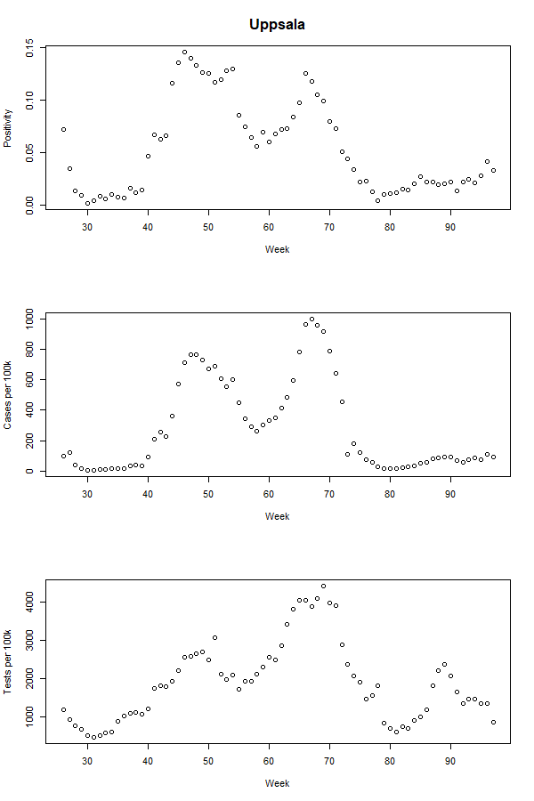
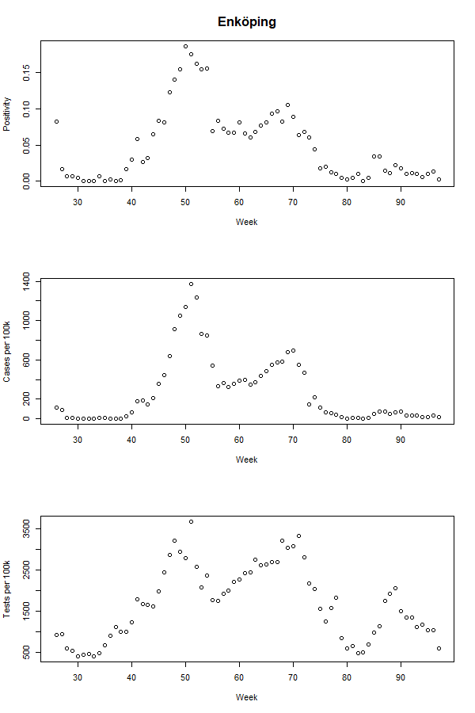
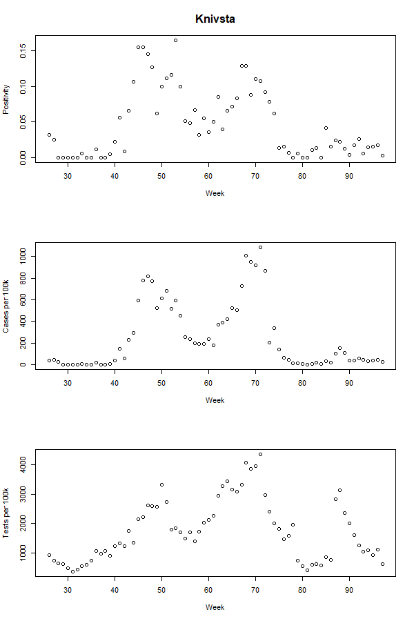
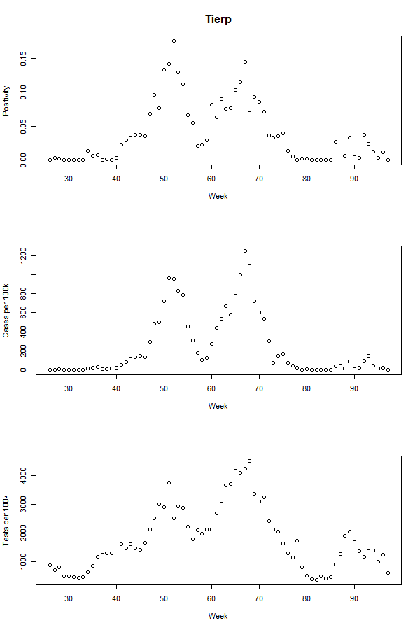
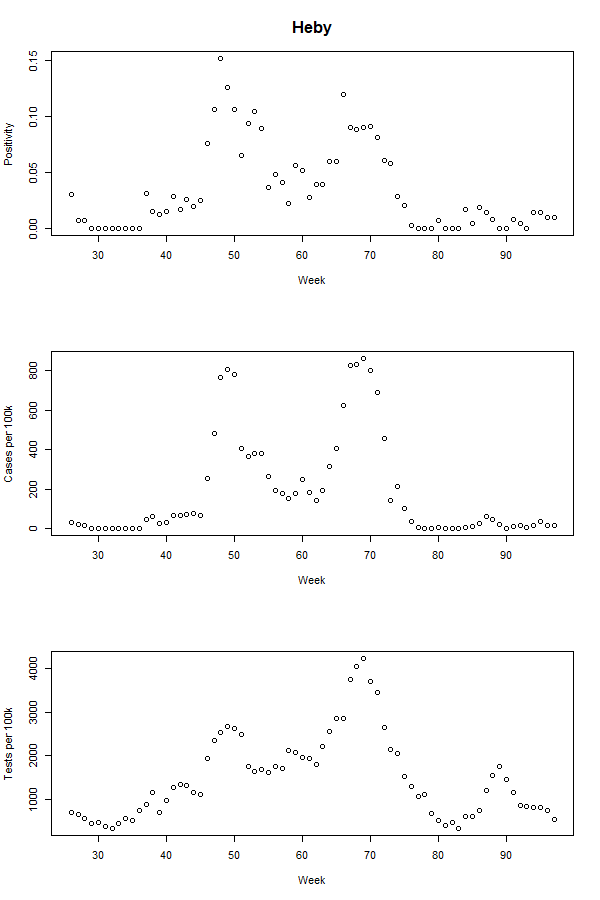
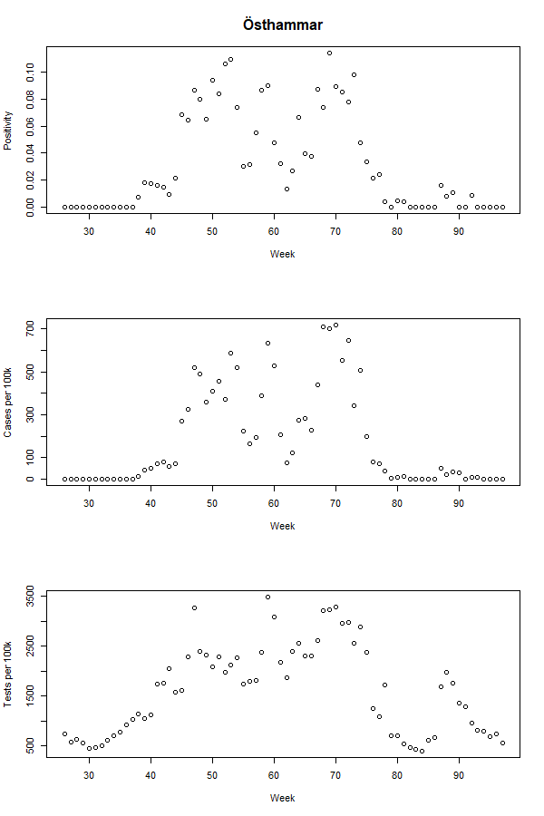
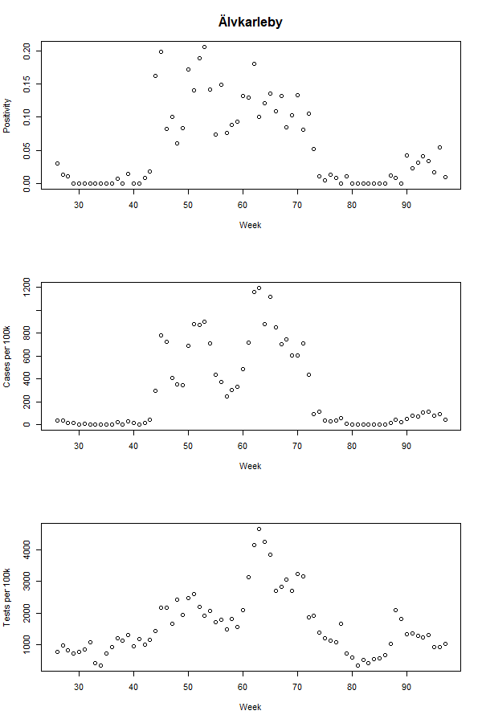

## Welcome to CovidHotspots!


### Here comes an interactive plot of Enköping for week 48
<iframe src="enkoping_map.html" height="500" width="500"></iframe>

### Some other plots are listed bellow

 </div>
 </div>
 </div>
 </div>
 </div>
 </div>
 </div>
 </div>

You can use the [editor on GitHub](https://github.com/MAAJ21/CovidHotspots/edit/gh-pages/index.md) to maintain and preview the content for your website in Markdown files.


Whenever you commit to this repository, GitHub Pages will run [Jekyll](https://jekyllrb.com/) to rebuild the pages in your site, from the content in your Markdown files.

### Markdown

Markdown is a lightweight and easy-to-use syntax for styling your writing. It includes conventions for

```markdown
Syntax highlighted code block

# Header 1
## Header 2
### Header 3

- Bulleted
- List


1. Numbered
2. List

**Bold** and _Italic_ and `Code` text

[](https://github.com/MAAJ21/CovidHotspots/interactiveplot.html) and  
```

For more details see [Basic writing and formatting syntax](https://docs.github.com/en/github/writing-on-github/getting-started-with-writing-and-formatting-on-github/basic-writing-and-formatting-syntax).

### Jekyll Themes

Your Pages site will use the layout and styles from the Jekyll theme you have selected in your [repository settings](https://github.com/MAAJ21/CovidHotspots/settings/pages). The name of this theme is saved in the Jekyll `_config.yml` configuration file.

### Support or Contact

Having trouble with Pages? Check out our [documentation](https://docs.github.com/categories/github-pages-basics/) or [contact support](https://support.github.com/contact) and we’ll help you sort it out.
